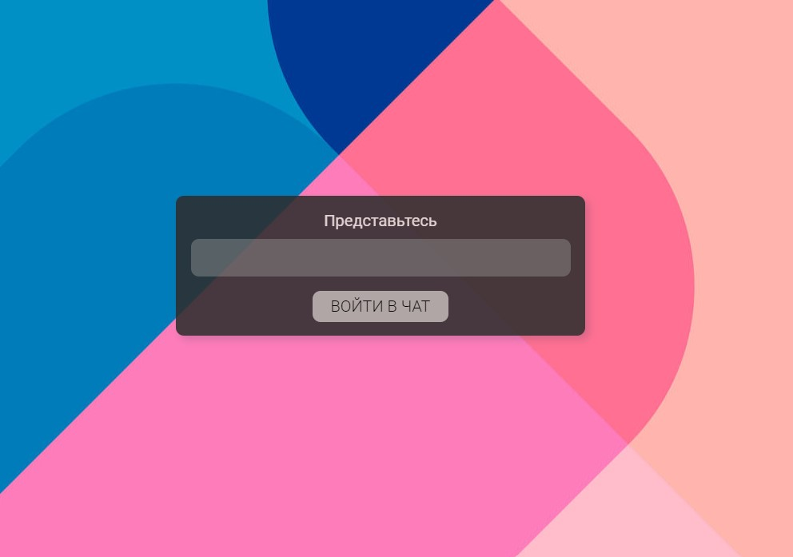
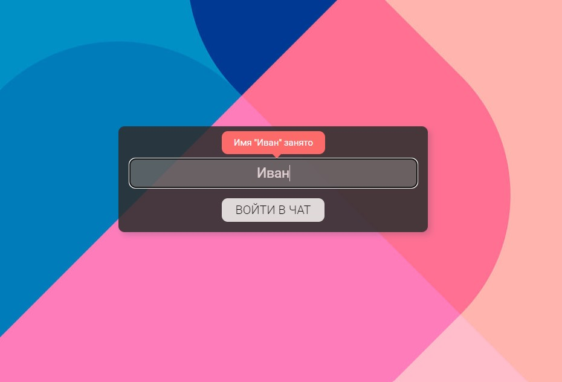
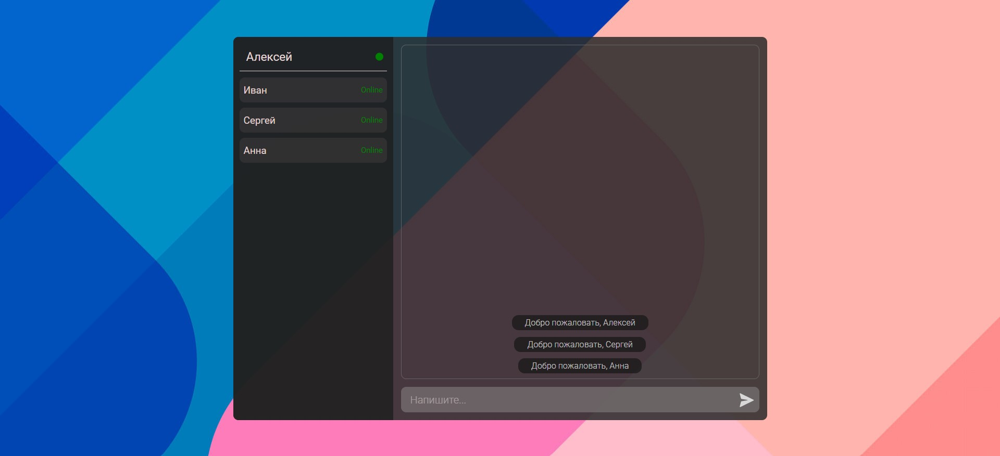
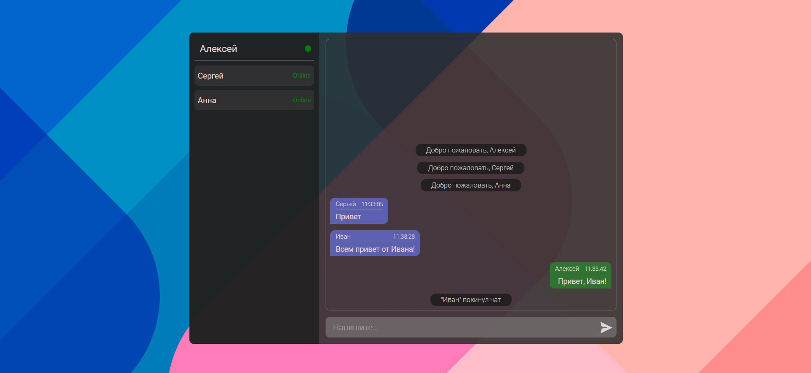
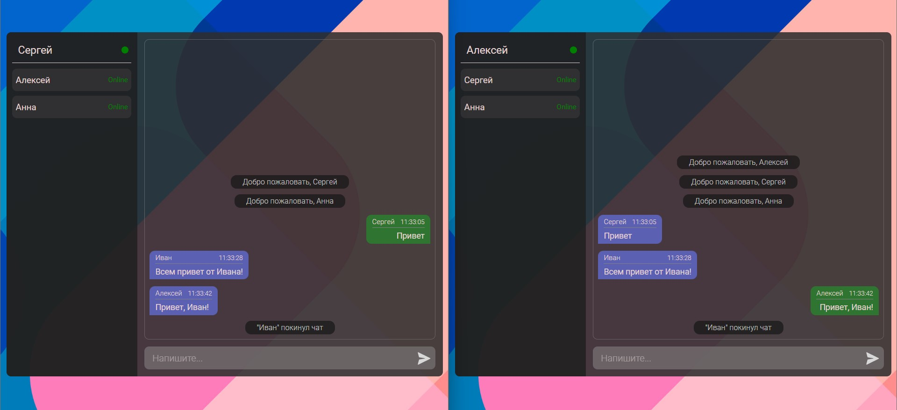

## Чат

### Описание

В данном проекте имеется  [серверная](https://github.com/lekseff/Messenger__Backend "Серверная часть") и клиентская часть. Соединение устанавливается через WebSocket. Серверная часть реализована с помощью Express.

При загрузке страницы появляется всплывающее окно, в котором запрашивается никнейм, под которым вы будете зарегистрированы в чате:

Если такой никнейм свободен, то открывается окно чата, в противном же показывается сообщение об ошибке.

Общее окно чата:

В левой части Ваше имя и список подключенных пользователей. При подключении или отключении пользователя показывается информационное сообщение.
Сообщения участников чата выравниваются по левому краю, а ваши - по правому.

